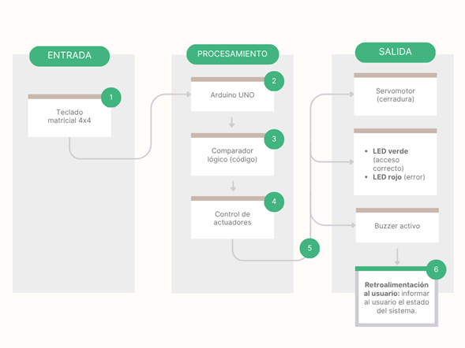
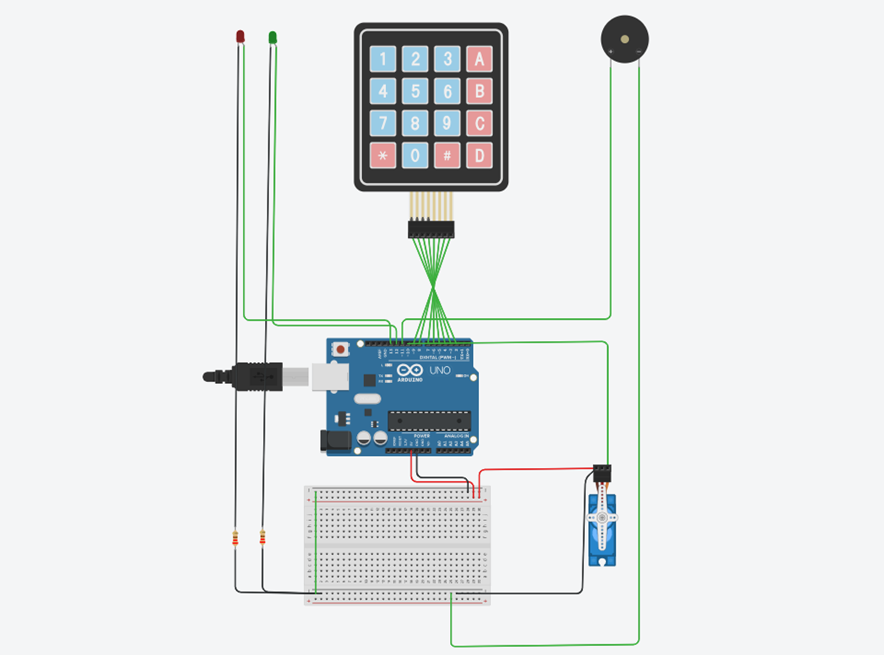
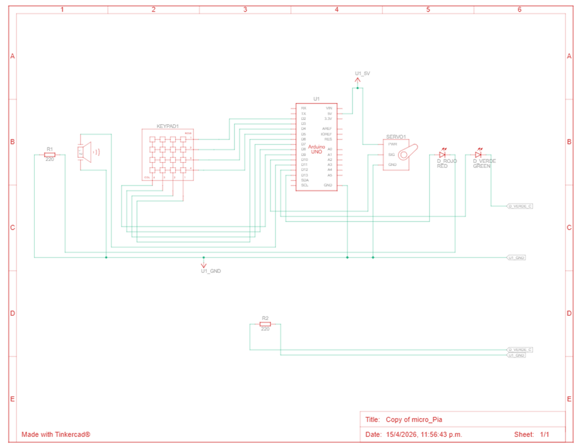

## Información del proyecto: Cerradura con Teclado y Contraseña 

Autores: 
- Brandon Yahir Escobedo Rodriguez 1998697	
- Mauricio Campos Tamez	2002942	
- Andrea Danaee Arrieta Martínez 2005151	

Materia: Laboratorio de controladores y microcontroladores programables. 

Docente: Ing. Héctor Hugo Flores Moreno 

Fecha: 16-04-2026

## Descripción general del proyecto

Este proyecto consiste en una cerradura electrónica controlada mediante un teclado matricial 4x4 conectado a un Arduino uno R3. Permite al usuario ingresar una contraseña (PIN) para activar un servomotor que simula la apertura de una puerta. En caso de errores repetidos, se activa una alarma sonora mediante un buzzer y una señal visual con LED.

## Problema que resuelve

Este sistema simula un mecanismo de seguridad de acceso restringido, permitiendo controlar la apertura de una “puerta” mediante autenticación por contraseña, evitando accesos no autorizados.
En un contexto real, resuelve la necesidad de proteger espacios físicos o dispositivos donde no se desea acceso libre, como habitaciones, laboratorios, lockers o cajas de seguridad. A diferencia de cerraduras tradicionales, este tipo de solución permite un mayor control sobre quién puede ingresar, reduciendo riesgos asociados a llaves físicas como pérdida, duplicación o uso indebido.
Además, introduce un mecanismo de seguridad adicional al limitar los intentos de acceso y activar una alarma ante múltiples fallos, lo cual ayuda a disuadir intentos de intrusión. Este tipo de sistemas es una base para soluciones más avanzadas utilizadas en control de acceso moderno, como sistemas electrónicos en oficinas, edificios o instalaciones industriales.

## Propósito
El objetivo principal es diseñar e implementar un sistema funcional de control de acceso que permita aplicar conceptos de microcontroladores, manejo de entradas/salidas digitales y control de actuadores.

## Contexto
Este sistema puede ser aplicado en:
* Puertas electrónicas
* Cajas de seguridad
* Sistemas de acceso en oficinas o laboratorios
* Proyectos educativos de electrónica y programación
Además, el proyecto se desarrolla en el contexto de microcontroladores programables de bajo costo, utilizando componentes accesibles y ampliamente disponibles como el Arduino UNO, un teclado matricial 4x4, un servomotor, LEDs y un buzzer. Esto permite replicar soluciones reales de control de acceso sin requerir hardware especializado o costoso.

## Alcance

### Incluye

* Validación de una contraseña fija
* Control de apertura/cierre mediante servomotor
* Indicadores visuales (LEDs)
* Alarma sonora tras intentos fallidos

### No incluye

* Conectividad remota
* Base de datos de usuarios
* Interfaz gráfica avanzada

## Cómo funciona internamente?

### Descripción general

El sistema funciona mediante la interacción entre dispositivos de entrada (teclado), un módulo de procesamiento (Arduino) y dispositivos de salida (servo, LEDs y buzzer). El usuario introduce una contraseña que es evaluada por el microcontrolador, el cual decide si permite o no el acceso.

### Arquitectura del sistema

#### Entrada

* Teclado matricial 4x4

#### Procesamiento

* Arduino UNO

#### Salida

* Servomotor
* LED verde
* LED rojo
* Buzzer

### Flujo del sistema

1. El sistema inicia con la puerta cerrada
2. El usuario ingresa la contraseña
3. Presiona `#` para validar
4. Si es correcta → abre servo + LED verde
5. Si es incorrecta → LED rojo + buzzer
6. Después de 3 intentos fallidos → alarma


## Estructura del proyecto
```
Proyecto-Cerradura_con_teclado_y_Contrase-a
│
├── lab_micro.ino
├── LICENSE
├── .gitignore
├── README.md
├── /diagramas
│   ├── diagrama_bloques.png
│   ├── diagrama_flujo.png
│   └── diagrama_esquematico.png
```

## Tecnologías utilizadas

### Requisitos del Hardware

* Arduino UNO
* Teclado matricial 4x4
* Servomotor
* LEDs (rojo y verde)
* Buzzer
* Resistencias 220Ω

### Requisitos del Software 

* Arduino IDE
* Lenguaje C/C++
* Librerías:

  * Keypad.h
  * Servo.h


## Conexiones del sistema

| Componente       | Pin Arduino |
| ---------------- | ----------- |
| Filas teclado    | 2, 3, 4, 5  |
| Columnas teclado | 6, 7, 8, 9  |
| Servo            | 10          |
| Buzzer           | 11          |
| LED verde        | 12          |
| LED rojo         | 13          |


## Comunicación entre módulos

* El teclado envía datos al Arduino mediante pines digitales
* El Arduino procesa la contraseña
* El servo recibe señal PWM
* LEDs y buzzer reciben señales digitales
* Todo ocurre dentro del ciclo `loop()`


## Decisiones técnicas

* Uso de contraseña fija para simplificar
* Contador de intentos para seguridad
* Uso de PWM para control del servo
* Teclado matricial para optimizar pines
* Retroalimentación visual y sonora

## Instalación y ejecución

### Instalación

1. Clonar el repositorio:

```bash
git clone https://github.com/BrandonEscobedo/Proyecto-Cerradura_con_teclado_y_Contrasena
```

2. Abrir el archivo:

```
lab_micro.ino
```

3. Instalar librerías en Arduino IDE:

* Keypad
* Servo

### Ejecución

1. Conectar el circuito según la tabla de conexiones
2. Seleccionar:

   * Placa: Arduino UNO
   * Puerto correcto según donde se conecto 
3. Subir el código
4. Probar el sistema


## Uso

* Ingresar contraseña (ejemplo: `1234`)
* Presionar `#` para validar
* Presionar `*` para borrar


## Pruebas

Se realizaron pruebas para validar el comportamiento del sistema:

* Acceso correcto → abre servo + LED verde
* Acceso incorrecto → LED rojo + buzzer
* 3 intentos fallidos → alarma
* Validación de LEDs en cada estado

## Contribución

1. Clonar el repositorio
2. Crear una rama
3. Realizar mejoras
4. Documentar cambios
5. Enviar pull request

## Simulación (Tinkercad)

Se incluye una simulación del proyecto en Tinkercad para facilitar la comprensión y permitir probar el sistema sin necesidad de hardware físico.

Link de la simulación:
```
https://www.tinkercad.com/things/7DyngwwBPCO-micropia?sharecode=4p2gxqOqlpozgwG4k3_QkpuPfoD9Gry3laLse22mmSg
```

**Uso de la simulación:**
- Abrir el enlace en el navegador
- Iniciar la simulación
- Probar el ingreso de la contraseña (`1234`) desde el teclado
- Verificar el comportamiento del servo, LEDs y buzzer

> Nota: Este recurso es opcional y sirve como apoyo visual para replicar el circuito y validar el funcionamiento antes de implementarlo físicamente.

---
## Diagramas

El proyecto incluye:

* Diagrama de bloques



* Diagrama pictorico


* Diagrama esquemático



## Resumen técnico

Sistema embebido basado en Arduino que integra:

* Entrada digital (teclado)
* Procesamiento lógico
* Salidas físicas (servo, LEDs, buzzer)


## FAQ

**¿Se puede cambiar la contraseña?**
Sí, modificando la variable en el código.

**¿Por qué no funciona el teclado?**
Revisar conexiones de filas y columnas.

**¿Por qué el servo no gira?**
Verificar alimentación y pin.

